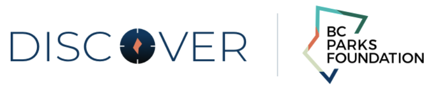

# BC Parks Foundation

BC Parks Foundation is a Mobile App build with React Native Technology that can be deployed in both ios and Android (with some ajustments) platforms.

## 

## Some Screenshots from Mobile App:

## Description

BC Parks Foundation is a Mobile App to connect people to Outdoor hosted events or selfguided tours, where is possible to buy your ticket, save your favorite events/tours or get in touch with one the hosts.

## Instalation and run instruction

Download the project, save it in your computer and open the folder in terminal.

## To complete instalation run

```console
$ cd client
$ npm init
$ cd ios
$ pod install
$ cd ..
```

### Or

```console
$ cd client
$ yarn init
$ cd ios
$ pod install
$ cd ..
```

### Case you `don't have` neither npm or yarn check the website bellow:

https://www.npmjs.com/get-npm
https://yarnpkg.com/lang/en/docs/install/#mac-stable

### Run (from client)

```bash
react-native run-ios
```

### To run this, `Xcode` from Apple Store must be previously installed

---

## Technology involved

- React Native
- Prisma
- Apollo

---

## Authors

- Alex
- Matt
- Yongmin
